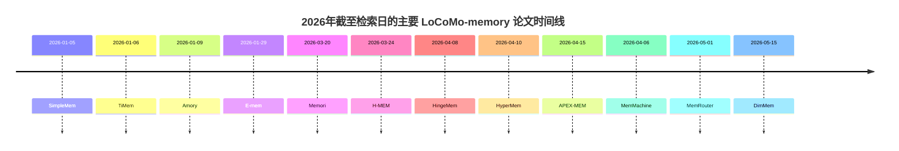
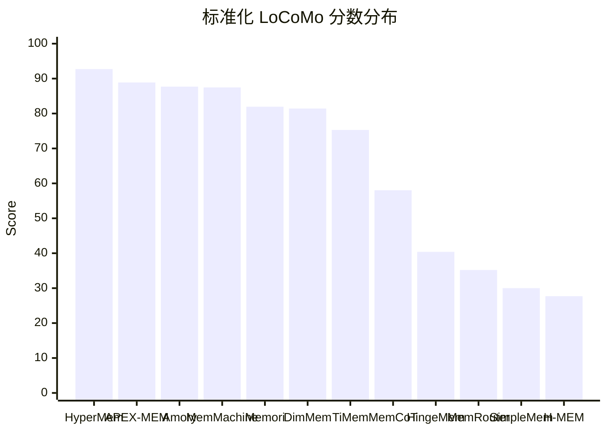

# 2026年 LoCoMo 导向 Memory 论文深度研究报告

## 执行摘要

截至检索日 **2026-05-20**，我检索到的 **2026 年公开论文/预印本中，能直接在 LoCoMo 或其紧邻变体上给出可比较绝对分数的高置信方法论文共有 13 篇**；另有一批 2026 年论文明确在 LoCoMo 上做了实验，但公开摘要/检索页只给出**相对提升**、**局部子任务**、**特殊模式分数**，或仅说明“优于 SOTA”而未公开完整绝对值，我将它们纳入补充表，避免遗漏但不强行排序。需要特别强调的是：**2026 年论文之间的可比性并不完美**。一个核心原因是，LoCoMo 在 2026 年出现了两套常用评测口径：**原始 ACL 2024 版本**（50 对话，7,512 QA）与**社区常用 GitHub 子集**（10 对话，1,986 QA），而不少论文又进一步**去掉 adversarial 类别**，只在 1,540 个问题上报告结果。这个口径漂移，会直接影响榜单解读。citeturn3search17turn18search21turn24view0turn25view0

如果只看**高置信、绝对值已公开**的 2026 方法论文，当前最强梯队是：**HyperMem 92.73**、**APEX-MEM 88.88**、**Amory 87.7**、**MemMachine 87.47（公平比较口径）**、**Memori 81.95**、**DimMem 81.43**、**TiMem 75.30**。其中前几名有一个非常明显的共同点：它们都不再把“memory”当成简单的平铺向量检索，而是转向**结构化记忆单元、图/超图组织、时间一致性建模、以及 retrieval-time reasoning**。相对而言，2026 年很多“轻量/高效”工作在开销上做得更漂亮，但若只看公开绝对分数，整体仍明显落后于最强的结构化/图式方法。citeturn33view0turn36view0turn42view0turn30view0turn6view0turn32view0turn25view0

从评测方法看，**直接用 J-score / accuracy 的论文越来越多**，而一部分论文仍主要报告 **F1/BLEU**。为满足你“按 LoCoMo 性能列表并统一到 gpt-4o-mini 类基准”的要求，我采用了一个**保守的、可复现的标准化策略**：优先保留论文原始 **J-score/accuracy**；对于只给 **F1** 的论文，我根据 HingeMem 在同一基准上同时报告的 **Overall F1 与 Overall J-score** 做了线性代理换算；对于 backbone 差异（如 GPT-4.1-mini、GPT-4o、Claude 3.5 Sonnet、Qwen2.5-7B），**不做激进的统一扣分/加分**，而是把 backbone 明确写入表中，并将 MemMachine 同一系统上 **gpt-4.1-mini 相对 gpt-4o-mini 约高 3.7 分** 作为“灵敏度参考带”，而不是硬性的全局修正项。这样做比强行“拍脑袋换算”更严谨。citeturn24view0turn30view0

## 方法论与口径

本报告的**检索范围设定为 2026-01-01 至 2026-12-31**，但由于本次实际检索日为 **2026-05-20**，因此报告只覆盖**截至该日已经公开的 2026 论文/预印本**，无法覆盖 2026 下半年尚未公开的工作。检索优先级按你的要求执行：**官方/原始论文页 > arXiv > ACL Anthology > OpenReview > 论文自带 GitHub/代码页**；其中对 LoCoMo 基准口径、实验表格和作者声明，我优先采用论文原文或官方论文页；对“引用数”，优先记载检索页直接显式显示的值，未显式显示者标记为“未查得”。citeturn33view0turn36view0turn42view0turn30view0turn6view0turn25view0

标准化口径如下。**基准空间**：我把 2026 年最常见的可比较对象定义为 **LoCoMo QA 的 J-score / accuracy 空间**，优先对应社区高频使用的 repo 子集；若论文明确只评估 **Categories 1–4（不含 adversarial）**，则保留该口径并在表中注明 1,540 QA；若论文评估 **1–5 全部类别** 或 **原始 7,512 QA 全集**，则保留原口径并标记“弱可比”。**指标空间**：对直接报告 accuracy/J-score 的论文，标准化分数等于原值；对只给 Overall F1 的论文，我根据 HingeMem 同表报告的 Overall F1 与 Overall J-score，拟合出一个经验代理：**J ≈ 0.593 × F1 + 4.31**，该代理的拟合优度约 **R²≈0.96**，但我只把它当成“保守近似”，因此相关行会标记为 **F1→J 代理**。**模型空间**：对 GPT-4o-mini、GPT-4.1-mini、GPT-4o、Claude 3.5 Sonnet、Qwen2.5-7B 等 answer backbone，我**不做全局硬校正**；原因是 2026 年公开的同系统 paired evidence 仍然很少。唯一比较清楚的同系统 paired 案例是 MemMachine：同一系统下，**gpt-4.1-mini 比 gpt-4o-mini 高约 3.7 分**，所以我把它写进“归一化说明”，作为解释而不是硬性减分。citeturn24view0turn25view0turn30view0

还需要单独说明 **LoCoMo 数据口径漂移**。原始 LoCoMo 论文报告的是 **50 个超长对话、7,512 个 QA 对**；但 HingeMem 明确写到，2026 年很多社区工作使用的是 **LoCoMo GitHub 仓库提供的更小代表性子集**，其统计量变成 **10 个对话、1,986 个问题**；TiMem 进一步明确说明其 LoCoMo 评估只使用 **1,540 个问题**，即去掉 adversarial 后的四类问题。这意味着“92 分”和“75 分”不一定来自完全同一张试卷，阅读榜单时必须结合“测试集/子集”列一起看。citeturn3search17turn24view0turn25view0

## 可排序总表

下表按**标准化后的 LoCoMo 分数**降序排序。为兼顾可读性，我把“训练/微调数据、代码、引用、复现、优缺点、备注”压缩到同一列；如原论文未提供，我按你的要求写为“未提供”或“未查得”。

| 论文 | 来源与日期 | DOI / arXiv | 两句摘要 | 模型名称与规模 | 原始 LoCoMo 指标值与测试集 | 归一化说明 | 标准化 LoCoMo 分数 | 训练/微调数据、代码、引用、复现、优缺点、备注 | 来源 |
|---|---|---|---|---|---|---|---:|---|---|
| **HyperMem: Hypergraph Memory for Long-Term Conversations** | ACL 2026 Main；arXiv v2：2026-04-10 | arXiv:2604.08256；DOI 10.48550/arXiv.2604.08256 | 用超图而非普通图，把 topic / episode / fact 三层记忆及其高阶联合关系显式编码。作者报告在 LoCoMo 上达到新的 SOTA，强调高阶关联比 pairwise graph 更利于跨会话检索。 | 摘要页未提供 answer backbone；参数量未提供 | **92.73% LLM-as-a-judge accuracy**；LoCoMo（子集口径未在摘要页写明） | 已是 accuracy/J-score，**不再换算**；但子集口径未明，记为“中等可比” | **92.73** | 训练/微调：未提供。代码：未见公开链接。引用数：未查得。复现：未查得。优点：高阶关系建模、强检索组织能力；缺点：工程复杂度较高，资源与延迟细节未公开。 | citeturn33view0 |
| **APEX-MEM: Agentic Semi-Structured Memory with Temporal Reasoning for Long-Term Conversational AI** | ACL 2026 Main；arXiv：2026-04-15 | arXiv:2604.14362；DOI 10.48550/arXiv.2604.14362 | 用 property graph + append-only 存储保留时间演化全过程，再由多工具 retrieval agent 在查询时解决冲突与更新。论文强调比会话感知方法更擅长 temporal coherence。 | 摘要页未提供；参数量未提供 | **88.88% accuracy**；LoCoMo QA task（子集未明） | 已是 accuracy，**不再换算**；子集未明，记为“中等可比” | **88.88** | 训练/微调：未提供。代码：未见公开链接。引用数：未查得。复现：未查得。优点：时序一致性强；缺点：图存储与 agentic retrieval 可能带来较高工程负担。 | citeturn36view0 |
| **Amory: Building Coherent Narrative-Driven Agent Memory through Agentic Reasoning** | EACL 2026 Long；arXiv：2026-01-09 | arXiv:2601.06282；ACL DOI 10.18653/v1/2026.eacl-long.183 | Amory 不是把对话切成孤立片段，而是把碎片组织成 episodic narratives，再把外围事实 semanticize 成语义记忆。检索时依靠 coherence-driven reasoning，在质量接近 full context 的同时，把在线延迟压低约一半。 | **Claude 3.5 Sonnet V2**；参数未提供 | **87.7 J-score（EM+SM setting）**；四类推理任务（Multi-hop / Temporal / Commonsense / Single-hop） | 已是 J-score，**不再换算**；backbone 不是 gpt-4o-mini 家族，因此仅做“协议对齐”，不做硬校正 | **87.70** | 训练/微调：未见梯度训练，偏 agentic/offline construction。代码：未见公开代码。引用数：未查得。复现：未查得。优点：叙事一致性、temporal 强；缺点：agentic retrieval 延迟高于极轻量方案。 | citeturn41view0turn42view0turn42view1 |
| **MemMachine: A Ground-Truth-Preserving Memory System for Personalized AI Agents** | arXiv：2026-04-06 | arXiv:2604.04853；DOI 10.48550/arXiv.2604.04853 | MemMachine 的核心主张是“尽量保留原始 episodic ground truth，而不是过早做有损抽取”。论文同时给出 gpt-4o-mini 与 gpt-4.1-mini 的 paired 结果，是本报告里少数能观察 backbone 灵敏度的工作。 | **gpt-4o-mini / gpt-4.1-mini** answer LLM；Judge 为 **gpt-4o-mini**；参数未提供 | **88.12（Agent mode） / 87.47（Memory-only fair comparison）**；LoCoMo 四类任务 | **标准化分数采用 87.47**，因为作者专门说明该行是与公开基线公平对比的口径；同系统 4.1-mini 比 4o-mini 高约 3.7 分，作为灵敏度参考 | **87.47** | 训练/微调：未做模型微调，主要是系统/检索优化。代码：**GitHub（MemMachine）**；作者提供 benchmark scripts。引用数：**4**。复现：**有作者自带复现实验脚本**。优点：可复现性和工程描述完整；缺点：需要 PostgreSQL + Neo4j + reranker，系统栈较重。 | citeturn30view0turn12search14 |
| **Memori: A Persistent Memory Layer for Efficient, Context-Aware LLM Agents** | arXiv：2026-03-20 | arXiv:2603.19935；DOI 10.48550/arXiv.2603.19935 | Memori 把对话转成 semantic triples + conversation summaries，主张“memory 是 structuring problem，不是纯存储问题”。它在只用约 **1,294 tokens / query** 的情况下把 LoCoMo 做到 81.95%，并宣称比多个检索式基线更省 token。 | **GPT-4.1-mini**（回答与 judge）；embedding 为 **Gemma-300**；参数未提供 | **81.95% overall**；LoCoMo 四类问题，**显式排除 adversarial** | 已是 accuracy；因属 mini-tier OpenAI backbone，按“gpt-4o-mini 类基准”**原值保留**，但需注意相对 gpt-4o-mini 可能存在数分的 backbone 灵敏度 | **81.95** | 训练/微调：未提供，偏 training-free。代码：**GitHub（Memori）**。引用数：**3**。复现：未检索到独立复现。优点：token 经济性很强；缺点：temporal 仍落后于部分强基线。 | citeturn6view0turn8search15 |
| **DimMem: Dimensional Structuring for Efficient Long-Term Agent Memory** | arXiv v2：2026-05-18 | arXiv:2605.15759；DOI 10.48550/arXiv.2605.15759 | DimMem 把 memory 拆成 time / location / reason / purpose / keyword 等显式维度，使召回和更新带有 schema。论文还强调：这种结构化抽取可以被 **Qwen3-4B** 这类小模型学会，而不必总依赖大模型。 | **Qwen3-4B extractor（经 schema fine-tune）**；answer backbone 在摘要页未完整披露；参数量仅 extractor 可知 | **81.43% overall accuracy**；**LoCoMo-10** | 已是 accuracy；但测试集是 **LoCoMo-10** 而非所有论文都用的同一子集，因此记“弱可比” | **81.43** | 训练/微调：对 extractor 做了 **schema fine-tune**，规模未提供。代码：**GitHub（DimMem）**。引用数：未查得。复现：未查得。优点：轻量且 schema 清晰，token 下降 24%；缺点：answer backbone 未完全写明，口径弱可比。 | citeturn32view0 |
| **TiMem: Temporal-Hierarchical Memory Consolidation for Long-Horizon Conversational Agents** | arXiv：2026-01-06 | arXiv:2601.02845；DOI 10.48550/arXiv.2601.02845 | TiMem 用 Temporal Memory Tree 把记忆分层固化，把 temporal continuity 当作一等公民。其公开页写得很清楚：LoCoMo 使用的是 **10 user groups / 1,540 questions / 不含 adversarial** 的口径。 | **gpt-4o-mini-2024-07-18** QA；**Qwen3-Embedding-0.6B**；参数未提供 | **75.30% LLJ accuracy**；LoCoMo 四类任务，共 **1,540 questions** | 已是 LLJ accuracy，直接保留；这是 2026 中最清楚写明测试口径的论文之一 | **75.30** | 训练/微调：未提供，框架式方法。代码：摘要页指向公开代码。引用数：**8**。复现：未查得独立第三方复现。优点：temporal 建模扎实，召回记忆长度下降 **52.2%**；缺点：绝对分数仍低于 2026 顶尖图式方法。 | citeturn25view0turn8search7 |
| **MemCoT: Test-Time Scaling through Memory-Driven Chain-of-Thought** | arXiv HTML 页：2026-04-09 | arXiv:2604.08216 | MemCoT 把 long-term perception 与短期 search-trajectory memory 结合起来，强调“主动式、多轮 memory-driven CoT”，而不是一次性检索。其 LoCoMo 主结果直接给出了 GPT-4o-mini 上的 overall score 58.03。 | **GPT-4o-mini** 主结果；另报 **Qwen2.5-14B/7B**；参数按各 backbone | **58.03 score**；LoCoMo 四类问题（841/282/96/321） | 论文直接把该 overall score 当主指标；与多数 2026 四类 LoCoMo 工作口径一致，直接保留 | **58.03** | 训练/微调：**training-free**。代码：未查得公开链接。引用数：未查得。复现：未查得。优点：在小/中模型上拉升显著；缺点：绝对分数仍低于顶尖结构化记忆系统。 | citeturn34view0 |
| **HingeMem: Boundary Guided Long-Term Memory with Query Adaptive Retrieval for Scalable Dialogues** | WWW 2026；arXiv：2026-04-08 | arXiv:2604.06845；DOI 10.48550/arXiv.2604.06845；WWW DOI 10.1145/3774904.3792089 | HingeMem 的关键思想是用 boundary-triggered hyperedges 写入记忆，并在查询时用 query-adaptive stop 决定“取什么、取多少”。它是本批 2026 论文里少数**同时公开 F1 / BLEU / J-score 全表**的工作，因此对跨论文指标对齐非常有价值。 | **GPT-4o**；embedding 为 **text-embedding-3-small**；参数未提供 | **Overall J-score = 40.4%**；同时给出 **Overall F1 = 63.9**；LoCoMo GitHub 子集 **1,986 QA / 含 adversarial** | 已直接给 J-score，优先用 **40.4**；该论文也被用于拟合 F1→J 的代理换算 | **40.40** | 训练/微调：未提供，偏 framework。代码：未见公开链接。引用数：未查得。复现：未查得。优点：评测表最完整；并报告 QA token cost 比 HippoRAG2 低 **68%**。缺点：绝对分数中等，且使用 GPT-4o 而非 mini-tier。 | citeturn22view0turn24view0 |
| **E-mem: Multi-agent based Episodic Context Memory System** | arXiv：2026-01-29 | arXiv:2601.21714；DOI 10.48550/arXiv.2601.21714 | E-mem 把 episodic context memory 做成 multi-agent 协同写入/检索，目标是在不暴涨 token 的前提下提升问答质量。公开摘要只给出“over 54% F1”，因此这里只能做下界式标准化。 | 摘要页未提供；参数未提供 | **>54% F1**；LoCoMo（子集未明） | 用 HingeMem 的 F1→J 代理换算，得到 **>36.3**；因原值就是下界，标准化也写成下界 | **>36.3** | 训练/微调：未提供。代码：未查得。引用数：**5**。复现：未查得。优点：token 成本下降 **>70%**；缺点：绝对值未完整公开。 | citeturn4search17 |
| **MemRouter: Memory-as-Embedding Routing for Long-Term Conversational Agents** | arXiv：2026-05-01 | arXiv:2605.00356；DOI 10.48550/arXiv.2605.00356 | MemRouter 把“写不写入 memory”这件事从 LLM 生成动作改成 embedding router 分类，训练的只是一个 **12M 参数**的小路由头。论文在 matched harness 下给出 Qwen2.5-7B 的 LoCoMo 整体 F1 52.0，并显著降低写侧延迟。 | **Qwen2.5-7B** QA backbone + **12M router head** | **52.0 F1**（对比基线 45.6）；LoCoMo，且另一页明确跟随 Memory-R1 的 **1:1:8 split / 去掉 adversarial** | 用 F1→J 代理换算；因为 split 特殊，只能看作“中低可比” | **≈35.2** | 训练/微调：**LoCoMo 监督训练 router，12M 参数**；规模细节未完全公开。代码：未查得。引用数：未查得。复现：未查得。优点：写侧非常快（p50 58ms）；缺点：绝对性能仍与顶尖图式方法有明显差距。 | citeturn37view0turn16search15 |
| **SimpleMem: Efficient Lifelong Memory for LLM Agents** | arXiv v3：2026-01-29；ICML | arXiv:2601.02553；DOI 10.48550/arXiv.2601.02553 | SimpleMem 的主线是 semantic structured compression + online semantic synthesis + intent-aware retrieval planning，偏“高密度、低 token”的 classic efficient-memory 设计。按其最强高能力模型设置，LoCoMo **Average F1 = 43.24**（GPT-4.1-mini）。 | **GPT-4.1-mini**（主结果）；另报 GPT-4o / Qwen3-Plus / 多个小模型 | **43.24 F1**（GPT-4.1-mini best high-capability setting）；LoCoMo 四类任务 | 用 F1→J 代理换算；不对 GPT-4.1-mini 做硬校正 | **≈30.0** | 训练/微调：未提模型微调。代码：**GitHub（SimpleMem）**。引用数：**7**。复现：未查得。优点：token 成本很低（531）；缺点：若只看绝对值，距离 2026 顶级方法差距很大。 | citeturn28view0turn29view0turn17search4 |
| **H-MEM: Hierarchical Memory for High-Efficiency Long-Term Reasoning in LLM Agents** | EACL 2026 Long | ACL DOI 10.18653/v1/2026.eacl-long.15 | H-MEM 使用分层记忆与位置索引逐层路由，和 2026 年大多数 repo 子集论文不同，它在**原始 LoCoMo 全集（50 对话、7,512 QA）**上报告多组小模型实验。其最强配置是 **DeepSeek-R1-7B** 下的 Average F1 39.43。 | **DeepSeek-R1-7B**（最佳 QA 配置）；BERT encoder；DeepSeek-R1-8B 做 memory analysis；参数量按公开模型名 | **39.43 F1 / 34.74 BLEU-1**（最佳配置）；**原始 7,512 QA 全集，含 five task settings** | 用 F1→J 代理换算得到约 **27.7**；但因使用的是原始全集，**弱可比** | **≈27.7** | 训练/微调：**无梯度更新**，只调外部记忆权重。代码：未查得。引用数：**3**。复现：未查得。优点：在小模型、本地部署场景有价值；缺点：需要 **2×RTX 4090**，且与 2026 repo 子集榜单弱可比。 | citeturn38view0turn39view0turn18search24 |

## 补充纳入表

下表纳入**2026 年明确使用 LoCoMo、但截至检索日未能从公开页面拿到可排序绝对 overall 分数**，或虽然拿到了分数但**评测模式过于特殊/口径高度不一致**的工作。它们不进入上表排序，但不应被忽略。

| 论文 | 公开时间与标识 | 公开页能确认的 LoCoMo 信息 | 未入主榜原因 | 简要判断 | 来源 |
|---|---|---|---|---|---|
| **EverMemOS: A Self-Organizing Memory Operating System for LLM Agents** | arXiv 2026-01-04；arXiv:2601.02163 | 摘要明确说在 LoCoMo 与 LongMemEval 上达到 SOTA，并给出代码；但摘要页未公开绝对 LoCoMo overall 值。 | 绝对分数未在公开摘要页显示 | 是 2026 年早期重要工作，值得后续人工补表。 | citeturn4search5turn7search17 |
| **SYNAPSE: Empowering LLM Agents with Episodic-Semantic Memory via Spreading Activation** | arXiv 2026-01-06；arXiv:2601.02744 | 公开页称“Comprehensive evaluations on LoCoMo show … significantly outperforms SOTA”，但未显示 absolute overall。 | 只有相对描述，缺 absolute | 偏神经启发式 episodic-semantic 设计。 | citeturn17search8 |
| **MAGMA: A Multi-Graph based Agentic Memory Architecture for AI Agents** | arXiv 2026-01-06；arXiv:2601.03236 | 公开页表明在 LoCoMo 与 LongMemEval 上实验；但搜索页未给 absolute overall。 | 搜索页未显示绝对值 | 引用数较高，说明传播较快。 | citeturn5search11 |
| **Membox: Weaving Topic Continuity into Long-Range Memory for LLM Agents** | arXiv 2026-01-07；arXiv:2601.03785 | 公开页给出 **temporal reasoning task 上最高 +68% F1 improvement**，并强调 token 更省。 | 只公开了局部/相对提升，缺 overall | 适合关注 topic continuity 的研究者。 | citeturn4search7turn17search7 |
| **Beyond Dialogue Time: Temporal Semantic Memory for Personalized LLM Agents** | arXiv 2026-01-12；arXiv:2601.07468 | 明确是 personalized temporal semantic memory，并在 LoCoMo 上评测；但公开摘要页未给绝对值。 | absolute overall 未公开 | 偏 temporal-personalization 路线。 | citeturn4search13 |
| **MemSkill: Learning and Evolving Memory Skills for Self-Improving LLM Agents** | arXiv 2026-02-04；arXiv:2602.02474 | 公开页写明在 LoCoMo、LongMemEval 等上优于强基线。 | 未公开 LoCoMo absolute overall | 更偏“memory skill learning”。 | citeturn4search15turn5search3 |
| **Choosing How to Remember: Adaptive Memory Structures for LLM Agents** | arXiv 2026-02-15；arXiv:2602.14038 | 公开页明确写 **在 LoCoMo 上平均提升 6.14%**。 | 只有相对提升，没有 paper-level absolute overall | 结构自适应选择是 2026 年的重要方向之一。 | citeturn16academia23turn18search2 |
| **H-Mem: Hybrid Multi-Dimensional Memory Management for Long-Context Conversational Agents** | EACL 2026 Long；ACL 2026.eacl-long.363 | 搜索页确认在 LoCoMo 上评测，并提到 **8.4-point improvement over single-axis retrieval** 一类结论。 | 检索页未给完整 overall 表 | 偏 temporal tree + semantic tree 双树记忆。 | citeturn40search1turn40search7 |
| **Lightweight LLM Agent Memory with Small Language Models** | ACL 2026 main；arXiv:2604.07798 | 搜索页写明 LoCoMo 上**平均比 A-MEM 高约 2.5 F1**，并给出 retrieval median 83ms、端到端 581ms。 | 只给相对提升，不给完整 overall | 重点是效率与 SLM 驱动的 memory ops。 | citeturn4search10turn17search0 |
| **Back to Basics: Let Conversational Agents Remember with Just Retrieval and Generation** | arXiv 2026-04-13；arXiv:2604.11628 | 搜索页写明在 LoCoMo 上**较最强基线提高 28.3% F1**。 | 无 absolute overall | 方法极简，但信息不足以纳入排序。 | citeturn16search12turn18search5 |
| **mem: Efficient Online Memory for Large Language Models** | arXiv 2026-05 | 摘要页仅说明在 LoCoMo 上达到 **1.20×** 增益。 | 仅相对倍数，无绝对值 | 更像 memory-augmented model architecture，而非典型 agent-memory system。 | citeturn4search6turn5search17 |
| **SuperLocalMemory V3.3: The Living Brain** | arXiv 2026-04-06；arXiv:2604.04514 | 搜索页写 **Mode A zero-LLM 70.4%**，并强调 CPU-only、本地运行。 | 模式特殊（Mode A/zero-LLM），与主榜口径差异大 | 适合关注本地化与 data sovereignty 的场景。 | citeturn4search0turn16search5 |
| **Graph-Native Cognitive Memory for AI Agents** | arXiv 2026-03；arXiv:2603.17244 | 搜索页写明 **LoCoMo token-level F1 = 0.565 overall**，且在 LoCoMo-Plus 上 93.3%。 | 主结果是 F1，且公开页未完整展示 backbone / test harness 细节 | 可视为图原生路线的中上游候选。 | citeturn5search29 |
| **Governed Memory: A Production Architecture for Multi-Agent Workflows** | arXiv 2026-03；arXiv:2603.17787 | 搜索页写明 **LoCoMo overall accuracy = 74.8%**。 | 标题/作者/完整设置在当前高置信资料里不完整 | 值得后续做二次核查。 | citeturn5search21 |
| **Multi-Layered Memory Architectures for LLM Agents** | arXiv 2026-03-31；arXiv:2603.29194 | 搜索页给出 **0.618 overall F1**，但同时出现 “LOCOMO、LOCCO、LoCoMo” 混名。 | benchmark 命名与设置存在混淆，先不并入主榜 | 适合后续做人工核验。 | citeturn4search11turn16academia22 |

另有几篇**2026 年与 LoCoMo 高度相关、但并非“单一可排序方法论文”**的工作，我单列说明：**LoCoMo-Plus** 是“超事实/认知约束记忆”的新 benchmark，而不是一条可直接按 LoCoMo 分数排序的方法线；**MemoryArena** 与 **AMemGym** 都更偏 memory evaluation / environment；**Memory in the LLM Era** 则是综述兼实验分析，适合作为阅读地图，但不适合以“单方法分数”入榜。citeturn4search1turn17search15turn7search12turn16search6

## 结果解析

从结构路线看，**2026 年最强方法几乎都在放弃“扁平 facts + 向量 Top-k”这一单一范式**。HyperMem 用超图把高阶联合依赖显式化；APEX-MEM 用 property graph + append-only 保留时间演化；Amory 用 narrative episodic memory + semantic memory 双轨；MemMachine 坚持 preservational episodic memory；DimMem 则把 memory 写成 typed / dimensional schema。这些高分方法虽然实现风格不同，但共同趋势很清楚：**记忆单元先结构化，再做 query-time reasoning**，而不是先把对话压扁，再希望 embedding 检索自己解决跨会话因果和时间线问题。citeturn33view0turn36view0turn42view0turn30view0turn32view0

从效率与成本看，2026 年并不是“只有大而复杂的方法才能赢”。Memori 以 **5% full-context tokens** 做到 81.95；TiMem 把 recalled memory length 降了 **52.2%**；HingeMem 相比 HippoRAG2 把 QA token cost 降了 **68%**；MemRouter 只训练 **12M router** 就能把写侧 p50 latency 从 **970ms 压到 58ms**；SimpleMem 与 DimMem 也都主打“结构压缩 + 低 token 成本”。不过，这类 efficient-memory 工作普遍面临一个现实：**当 absolute score 被完整公开时，它们通常仍落后于最顶级的图式/叙事式记忆框架**。换句话说，2026 年 Memory 论文已经不再是简单的“效果 vs 成本二选一”，而是分化成两条很清晰的路线：一条追求**最强 recall/reasoning**，另一条追求**工程可落地的 cost-latency**。citeturn6view0turn25view0turn24view0turn37view0turn29view0turn32view0

从可比性角度看，我认为你在后续真正做 literature matrix 时，**至少要同时保留三列条件变量**：**测试集口径**（原始 7,512 QA / repo 1,986 QA / 去 adversarial 的 1,540 QA / LoCoMo-10）、**主指标**（J-score/accuracy 还是 F1）、以及 **answer backbone**。如果把这些条件变量抹平，榜单会很危险。例如，TiMem 公开写明自己只用 1,540 问题；HingeMem 明确使用 1,986 问并包含 adversarial；H-MEM 则回到原始 7,512 QA 全集；Amory 用 Claude 3.5 Sonnet V2；MemMachine 则难得给出了同系统 gpt-4o-mini 与 gpt-4.1-mini 的 paired 结果，说明 backbone 差异本身就能造成数分波动。**因此，这份表更适合做“带条件的排行榜”，而不是绝对真理榜。** citeturn25view0turn24view0turn38view0turn42view1turn30view0

## 时间线与图表

下图展示截至 **2026-05-20** 的主要论文发布时间分布。可以看到，**2026 年的爆发点集中在一月与四月**：一月出现 TiMem / SimpleMem / Amory / H-MEM 等早期路线，四月开始则是图式化、schema 化和检索代理化方法的密集爆发。图中的节点均来自上表高置信条目。citeturn27view0turn25view0turn41view0turn38view0turn36view0turn30view0turn33view0turn37view0turn32view0turn20view0turn34view0

下图给出**高置信可排序条目**的标准化 LoCoMo 分数分布。为了防止误读，我刻意只放入主榜中分数最清晰的论文；其中带有 `≈` 的分数来自 **F1→J 代理换算**，请在阅读时与主表中的“归一化说明”对应起来看。

## 开放问题与局限

这份报告最重要的局限，不在“漏掉几篇论文”，而在于**2026 年 LoCoMo 评测已经明显出现 protocol fragmentation**。原始论文、repo 子集、去 adversarial 子集、LoCoMo-10、以及各种自定义 split 同时存在，很多论文在摘要里并不把这些条件说全。结果就是：**同样写“LoCoMo 81.4”或“LoCoMo 87.7”，可能并不是同一份试卷，也不一定用同一种评分器**。这也是我为什么宁愿把一部分论文放进补充表、“不强排”，也不愿给出一个看似整齐但实际上误导的总榜。

另外，**引用数**在 2026 年论文上波动很大，而且检索引擎并不总是显式显示；因此表中的引用数列只能理解为“截至检索日公开检索页上能直接看到的值”，不是严格的 Google Scholar 口径。再者，部分论文虽然在摘要/搜索页里宣称“达到 SOTA”，但**没有把 absolute overall score 暴露在公开页**，这类论文我没有硬填；你如果后续要做正式 survey 或投组会，我建议优先把补充表里的论文 PDF 再逐篇补表，尤其是 **EverMemOS、MAGMA、SYNAPSE、MemSkill、FluxMem、LightMem、Nano-Memory、H-Mem** 这些条目。当前报告已经把它们定位出来，但没有对它们做过度推断
